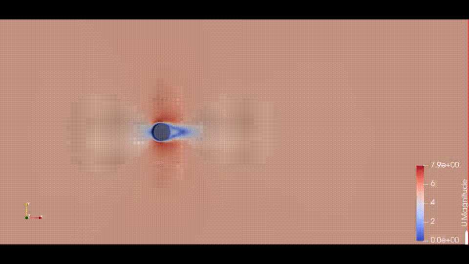
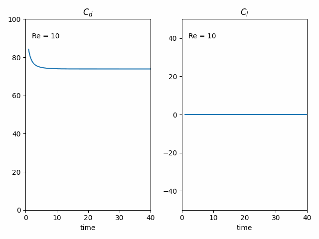

# Overview
Part of a (mini) project in fluid mechanics, I studied together with my teammate **Zoubir MOUSTATIA** 
(@mzoubir01) the classical example of a flow around a cylinder. 

Our focus was mainly on characterizing the flow by the **Reynolds number** (Re), 
the **drag and lift coefficient** and **Strouhal number**.

We have made simulations to identify laminar and turbulent flows.
We have also made simulations of drag and lift coefficient both as a function of time and Re.
Finally, we were able to deduce the evolution of Strouhal number as a function of Re.

We have used `OpenFOAM` as solver to simulate the system, `Paraview` to visualize the output,
and `Python` to postprocess data.

The project article can be found [here](article-fluid-mechanics.pdf).

# About this repository
We have gathered in this repository the python code that was developed to postprocess data. 
As a brief description:

- We have implemented a class `ReadCoefficientsFromFile` that extract the useful information 
from the output file and then process it *(mean, Fourier transformation, dominant frequency, …)*

- We have built a function `build_dict_simulations` that run over all the output files and 
thereby create a dictionary that gather all the simulations.

- The remaining python scripts located in `simulation_scripts` are meant to create plots and animations.

# Reproduce results
This repository is meant to guarantee the reproducibility of our findings. To do so follow the steps below:
1. Clone the repository
2. Download the simulation outputs from this [link](https://drive.google.com/drive/folders/1XzpBdKSqhBQ3qlluUzOHBqtRe3GKxTqs)
3. Move the simulations to the folder `simulation_outputs`
4. Do the same for experience data but rather put the downloaded items in `experience_data` folder

After doing that, all the scripts must work without any problems

# Some beautiful animations
Animation of velocity magnitude for Re = 1000

Animation of drag and lift coefficient when changing Re

> Done by: Badr MOUFAD & Zoubir MOUSTATIA
